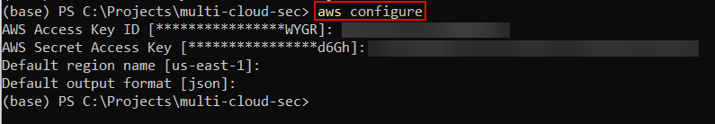

# Terraform Multi-Cloud Lab

This repository is a hands-on lab I created for exploring Terraform with the three largest cloud providers (AWS, Azure, and GCP) using their free-tier offerings. The goal is to learn how to:

1. Provision identical infrastructure on each platform  
2. Run tfsec to scan your Terraform code for security issues  

---

## Prerequisites

Ensure you have the following installed and configured:

- Terraform  
- AWS CLI  
- Azure CLI  
- Google Cloud SDK  
- tfsec  

---

## Getting Started

1. **Change to your project directory**  
   
    ```powershell
    cd path\to\your\terraform-project
    ```
    This should be the folder where your `main.tf` lives (see [main.tf on GitHub](https://github.com/jason0x6C69/multi-cloud-terraform/blob/main/main.tf)).

2. **Authenticate with AWS**  
   
    ```powershell
    aws configure
    ```

    Enter your Access Key ID and Secret Access Key so Terraform can provision resources in your AWS account.
    

4. **Authenticate with Azure**  
   
    ```powershell
    az login
    az account set --subscription <YOUR_SUBSCRIPTION_ID>
    ```

    The `az login` command opens a browser for credentials, and setting the subscription ensures Terraform targets the correct Azure account.
       

6. **Authenticate with Google Cloud**  
   
    ```bash
    gcloud auth application-default login
    gcloud config set project <YOUR_PROJECT_ID>
    ```

    These commands obtain application-default credentials and point Terraform at the correct GCP project.
       

8. **Initialize Terraform**  
   
    ```bash
    terraform init
    ```

    Downloads provider plugins, installs modules, and prepares your working directory for the next commands.
       

10. **Preview changes with Terraform Plan**  
   
    ```bash
    terraform plan
    ```

    Shows what Terraform will create, update, or destroy—without applying anything.
        

12. **Apply your infrastructure changes**  
   
    ```bash
    terraform apply
    ```

    Provisions (or updates) all resources defined in your `.tf` files. You’ll be prompted to confirm before changes are made.
        

14. **Scan for security issues with tfsec**  
   
    ```bash
    tfsec .
    ```

    Performs static analysis on your Terraform code and flags common misconfigurations and vulnerabilities.
       
    You can view my full analysis of the tfsec results in [tfsec-audit.md](tfsec-audit.md). 

